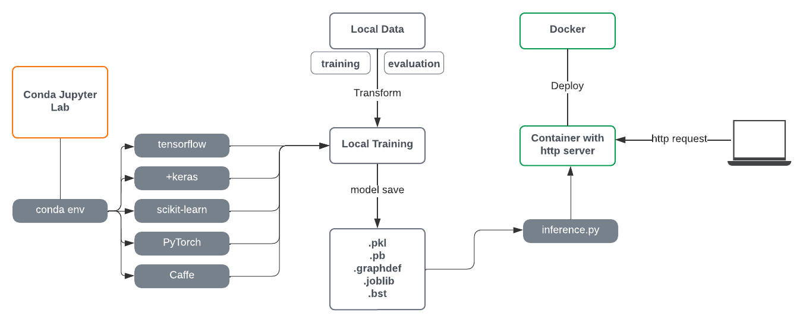
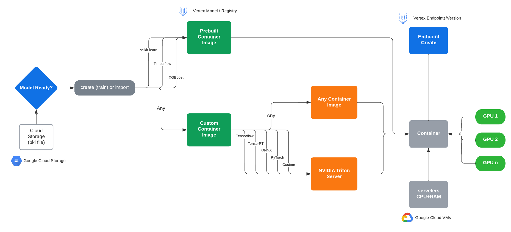

# Vertex AI Custom Container Deployment

**Snippets for Google Vertex AI!**

---

You can:

1. Building training code, container and run it locally.
2. Building deployment code, container and test it locally.
3. Upload and deploy it on Vertex Endpoints [here]

## Data Type

- http request in json format ({'instances' : [1,2,3,4]}) [more info](https://cloud.google.com/vertex-ai/docs/predictions/online-predictions-custom-models#formatting-prediction-input)

## Authentication

Create temporary [Application Default Credentials](https://cloud.google.com/docs/authentication/production#:~:text=a%20library%20called-,Application%20Default%20Credentials%20(ADC),-to%20automatically%20find).
```
gcloud auth application-default login
```
<details>
<summary>"Click to expand (notes)"</summary>
<br />
This will generate a json config file with temporary credentials under: ~/.config/gcloud/, the container has to be able to mount that file through docker volumes, that's why we will define a variable called ADC.

</details>


## Step 1: Building training code, container and run it locally.


| Local |
:------------------:



### Set your variables:

```
REGION=[your_region]
PROJECT_ID=[your_project]
BUCKET=[your_bucket]
BUCKET_FOLDER_ARTIFACTS=$BUCKET/[your_folder]
USERNAME=[linux_unix_username]
IMAGE_URI=$REGION-docker.pkg.dev/$PROJECT_ID/repo-models/[container_image_name]
ADC=/home/$USERNAME/.config/gcloud/application_default_credentials.json
```

### Create your bucket:

```
gsutil mb -l $REGION $BUCKET
```

### Create the folder structure:

```
if [ ! -d train ]; then
   mkdir train;
fi
cd train
```

### Create docker file (DockerFile):

```
cat << EOF > Dockerfile
FROM gcr.io/deeplearning-platform-release/tf2-cpu.2-6
WORKDIR /

# Copies the trainer code to the docker image.
COPY trainer /trainer

# Sets up the entry point to invoke the trainer.
ENTRYPOINT ["python", "-m", "trainer.train"]
EOF
```

### Create code for training (train.py):

```
if [ ! -d trainer ]; then
   mkdir trainer;
fi
```

```
cat << EOF > trainer/train.py
import warnings
import pandas as pd
import tensorflow as tf

warnings.filterwarnings('ignore')

from tensorflow import keras
from tensorflow.keras import layers

print(tf.__version__)

BUCKET = '$BUCKET_FOLDER_ARTIFACTS'

# Extraction process
dataset = pd.read_csv('https://storage.googleapis.com/jchavezar-public-datasets/auto-mpg.csv')
dataset.tail()

dataset.isna().sum()
dataset = dataset.dropna()
dataset['Origin'] = dataset['Origin'].map({1: 'USA', 2: 'Europe', 3: 'Japan'})
dataset = pd.get_dummies(dataset, prefix='', prefix_sep='')
dataset.tail()

train_dataset = dataset.sample(frac=0.8, random_state=0)
test_dataset = dataset.drop(train_dataset.index)

train_stats = train_dataset.describe()
train_stats.pop("MPG")
train_stats = train_stats.transpose()

train_labels = train_dataset.pop('MPG')
test_labels = test_dataset.pop('MPG')


def norm(x):
    return (x - train_stats['mean']) / train_stats['std']


normed_train_data = norm(train_dataset)
normed_test_data = norm(test_dataset)


def build_model():
    model_ai = keras.Sequential([
        layers.Dense(64, activation='relu', input_shape=[len(train_dataset.keys())]),
        layers.Dense(64, activation='relu'),
        layers.Dense(1)
    ])
    optimizer = tf.keras.optimizers.RMSprop(0.001)
    model_ai.compile(loss='mse',
                     optimizer=optimizer,
                     metrics=['mae', 'mse'])
    return model_ai


model = build_model()
model.summary()
EPOCHS = 1000

# The patience parameter is the amount of epochs to check for improvement
early_stop = keras.callbacks.EarlyStopping(monitor='val_loss', patience=10)
early_history = model.fit(normed_train_data, train_labels,
                          epochs=EPOCHS, validation_split=0.2,
                          callbacks=[early_stop])

# Export model and save to GCS
print(BUCKET)
model.save(BUCKET)
EOF
```

### Build model and run it:

```
docker build -t train .
```

```
docker run -ti --name train -e GOOGLE_APPLICATION_CREDENTIALS=/tmp/temp.json -v ${ADC}:/tmp/temp.json train
```


> Your training has finished and model has been stored in $BUCKET_FOLDER_ARTIFACTS.

<br />

## Step 2: Building code, container and test them locally.

### Preparing stage:

```
cd ..
if [ ! -d prediction ]; then
   mkdir prediction;
fi
cd prediction
```

### Build a webserver docker container to handle predictions; uvicorn

```
cat << EOF > Dockerfile
FROM tiangolo/uvicorn-gunicorn-fastapi:python3.7

COPY app /app
WORKDIR /app
RUN pip install sklearn joblib pandas tensorflow
CMD ["uvicorn", "main:app", "--host", "0.0.0.0", "--port", "8080"]

EXPOSE 8080
EOF
```

### Create code (logic) behind the webserver

```
if [ ! -d app ]; then
   mkdir app;
fi

```

```
cat << EOF > app/main.py
from fastapi import Request, FastAPI
from tensorflow import keras
import json
import os

app = FastAPI()

if os.environ.get('AIP_STORAGE_URI') is not None:
    BUCKET = os.environ['AIP_STORAGE_URI']
else:
    BUCKET = '$BUCKET_FOLDER_ARTIFACTS'
print(BUCKET)

model = keras.models.load_model(BUCKET)


@app.get('/')
def get_root():
    return {'message': 'Welcome mpg API: miles per gallon prediction'}


@app.get('/health_check')
def health():
    return 200


if os.environ.get('AIP_PREDICT_ROUTE') is not None:
    method = os.environ['AIP_PREDICT_ROUTE']
else:
    method = '/predict'

print(method)
@app.post(method)
async def predict(request: Request):
    print("----------------- PREDICTING -----------------")
    body = await request.json()
    instances = body["instances"]
    outputs = model.predict(instances)
    response = outputs.tolist()
    print("----------------- OUTPUTS -----------------")

    return {"predictions": response}
EOF
```

### Create a new repository in Google Cloud Platform to store containers.

```
gcloud artifacts repositories create repo-models --repository-format=docker \
--location=$REGION --description="Models repository"
```

### Tag container in Artifacts repository format:
```
docker build -t $IMAGE_URI .
```

### Run the container locally:
```
docker run --name predict \
  -e GOOGLE_APPLICATION_CREDENTIALS=/tmp/keys/FILE_NAME.json \
  -v ${ADC}:/tmp/keys/FILE_NAME.json \
  -p 732:8080 $IMAGE_URI
```

You can break it down with Ctrl+C.

For predictions, open a new terminal an make an http request with the data in json format:

```
curl -X POST -H "Content-Type: application/json" http://localhost:732/predict -d '{
 "instances": [[1.4838871833555929,
 1.8659883497083019,
 2.234620276849616,
 1.0187816540094903,
 -2.530890710602246,
 -1.6046416850441676,
 -0.4651483719733302,
 -0.4952254087173721,
 0.7746763768735953]]
}'
```

### Push image to Google Cloud Artifacts Repository

```
docker push $IMAGE_URI
```

---

## Step 3: Upload and deploy it on Vertex Endpoints.

| Google Cloud |
:------------------:


### Define Variables

```
ENDPOINT_NAME=[your_endpoint_name]
MODEL_NAME=[your_model_name]
DEPLOYED_MODEL_NAME=[your_deployed_model_name]
MACHINE_TYPE=n1-standard-2
```

### Upload Model

```
gcloud ai models upload \
  --region=$REGION \
  --display-name=$MODEL_NAME \
  --container-image-uri=$IMAGE_URI \
  --container-ports=8080 \
  --container-health-route=/health_check \
  --artifact-uri=$BUCKET_FOLDER_ARTIFACTS
```

### Create Endpoint

```
gcloud ai endpoints create \
  --display-name=$ENDPOINT_NAME \
  --region=$REGION
```

### List Model and Endpoint

```
MODEL_ID=$(gcloud ai models list \
  --region=$REGION \
  --filter=displayName:$MODEL_NAME \
  --format='value(name)')
```

```
ENDPOINT_ID=$(gcloud ai endpoints list \
  --region=$REGION \
  --filter=displayName:$ENDPOINT_NAME \
  --format='value(name)')
```

### Deploy Endpoint

```shell
gcloud ai endpoints deploy-model $ENDPOINT_ID\
  --region=$REGION \
  --model=$MODEL_ID \
  --display-name=$DEPLOYED_MODEL_NAME \
  --machine-type=$MACHINE_TYPE \
  --min-replica-count=1 \
  --max-replica-count=1 \
  --traffic-split=0=100
```

