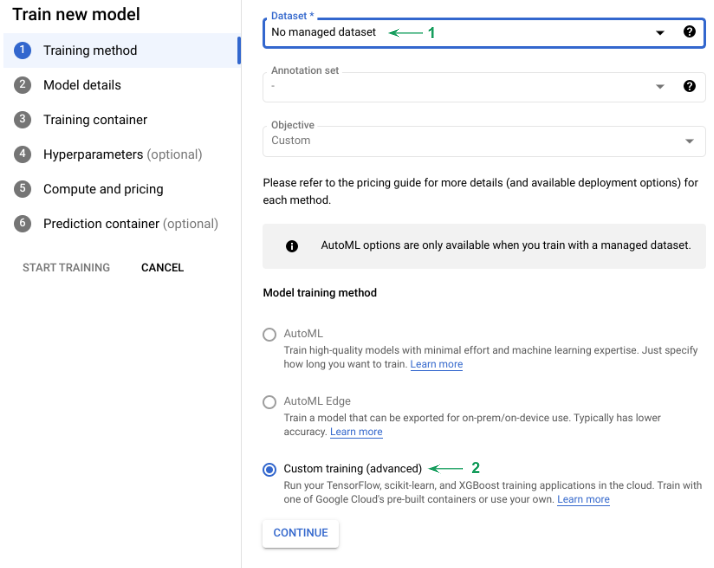
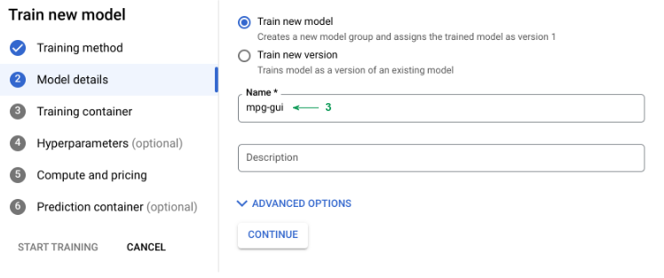
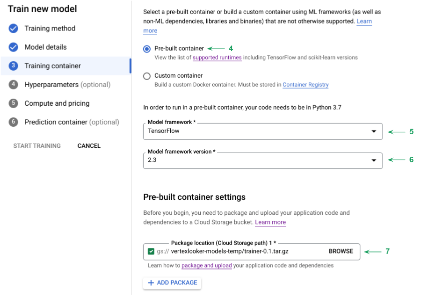
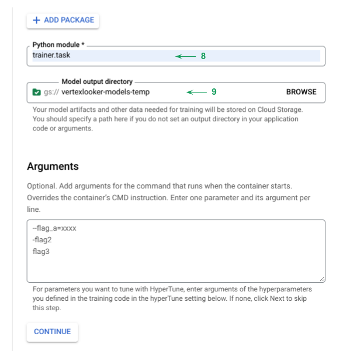
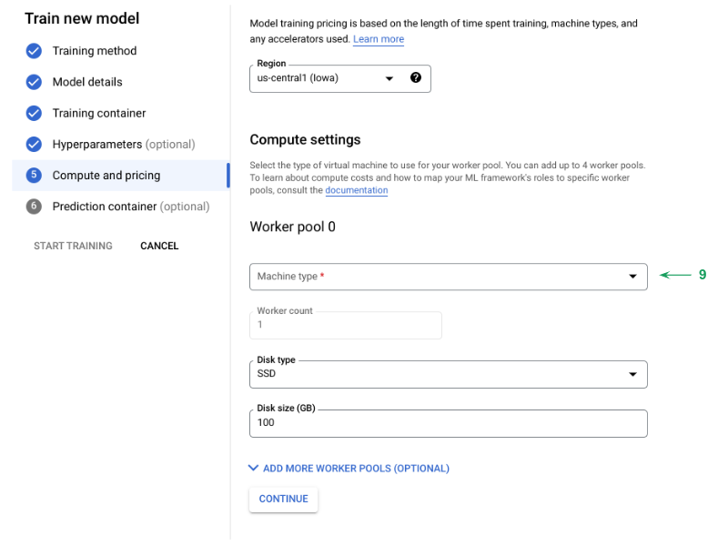
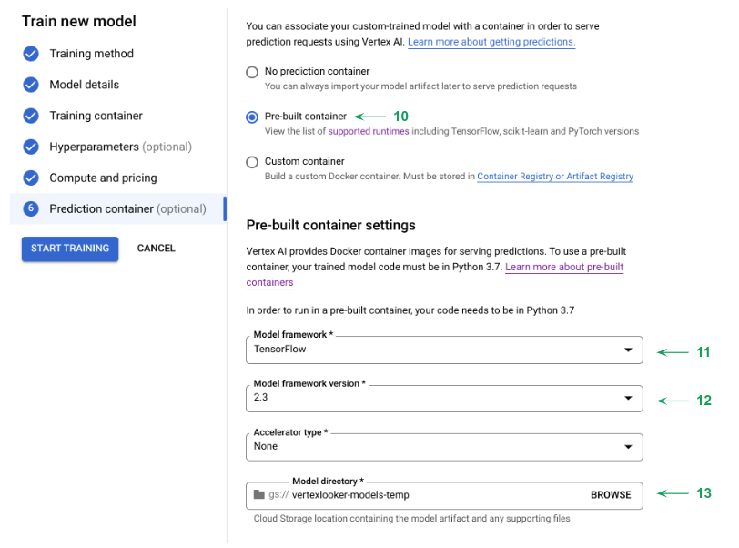
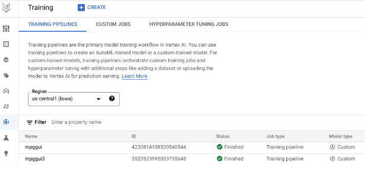
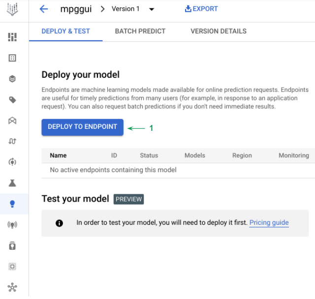
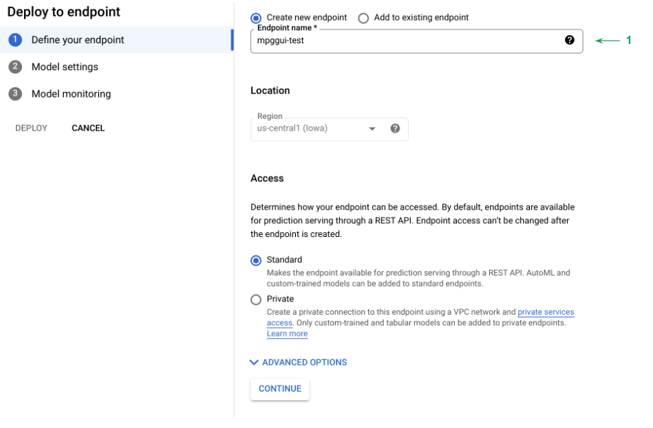
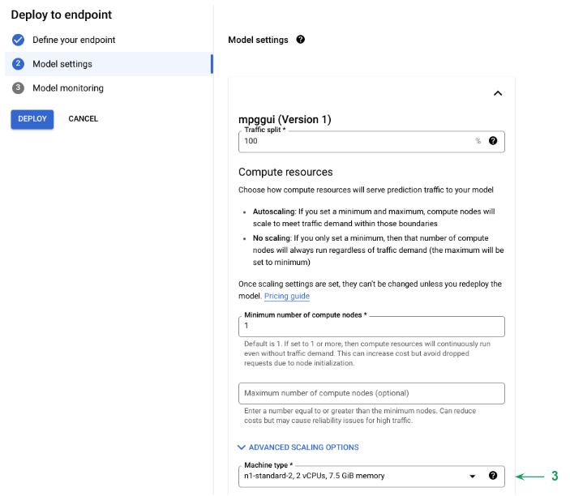

# Vertex AI Custom Container Deployment

**Snippets for Google Vertex AI!**

---

You can:

1. Package Assembly.
2. Train in Vertex Training.
3. Deploy it in Vertex Endpoints [here]

## Data Type

- http request in json format ({'instances' : [1,2,3,4]}) [more info](https://cloud.google.com/vertex-ai/docs/predictions/online-predictions-custom-models#formatting-prediction-input)

## Authentication

Just [login](https://console.cloud.google.com/) to GCP.

## Set your variables:

```shell
BUCKET_NAME=something                                                              # Bucket id in the following format: gs://NAME
```

## Step 1: Package Assemly.

<details>
<summary>"Before you start trainig"</summary>
<br />
These are the steps to build the package that contains the files for training (no need to wrap it up and containarize it).

Layout:
    
    - PKG-INFO
    - setup.cfg
    - setup.py
    - trainer
      - __init__.py
      - task.py
    
</details>

### Assemly the package:


```ruby
cat << EOF > setup.cfg
[egg_info]

tag_build =
tag_date = 0
EOF
```

```ruby
if [ ! -d trainer ]; then
   mkdir trainer;
fi
```

```ruby
touch trainer/__init__.py
touch trainer/task.py
```

```python
cat << EOF > setup.py
from setuptools import find_packages
from setuptools import setup

REQUIRED_PACKAGES = [
    'tensorflow==2.3.0', 
]
 
setup(
    name='trainer', 
    version='0.1', 
    install_requires=REQUIRED_PACKAGES,
    packages=find_packages(), # Automatically find packages within this directory or below.
    include_package_data=True, # if packages include any data files, those will be packed together.
    description='Regression to predict miles per gallon of fuel'
)
EOF
```

### Create training code:

```Python
cat << EOF > trainer/task.py
import warnings
import pandas as pd
import tensorflow as tf
import os

warnings.filterwarnings('ignore')

from tensorflow import keras
from tensorflow.keras import layers
import argparse

parser = argparse.ArgumentParser()
parser.add_argument('--model-dir', dest='model_dir',
                    default=os.getenv('AIP_MODEL_DIR'), type=str, help='Model dir.')
args = parser.parse_args()

# Extraction process
dataset = pd.read_csv('https://storage.googleapis.com/jchavezar-public-datasets/auto-mpg.csv')
dataset.tail()

dataset.isna().sum()
dataset = dataset.dropna()
dataset['Origin'] = dataset['Origin'].map({1: 'USA', 2: 'Europe', 3: 'Japan'})
dataset = pd.get_dummies(dataset, prefix='', prefix_sep='')
dataset.tail()

train_dataset = dataset.sample(frac=0.8, random_state=0)
test_dataset = dataset.drop(train_dataset.index)

train_stats = train_dataset.describe()
train_stats.pop("MPG")
train_stats = train_stats.transpose()

train_labels = train_dataset.pop('MPG')
test_labels = test_dataset.pop('MPG')


def norm(x):
    return (x - train_stats['mean']) / train_stats['std']


normed_train_data = norm(train_dataset)
normed_test_data = norm(test_dataset)


def build_model():
    model_ai = keras.Sequential([
        layers.Dense(64, activation='relu', input_shape=[len(train_dataset.keys())]),
        layers.Dense(64, activation='relu'),
        layers.Dense(1)
    ])
    optimizer = tf.keras.optimizers.RMSprop(0.001)
    model_ai.compile(loss='mse',
                     optimizer=optimizer,
                     metrics=['mae', 'mse'])
    return model_ai


model = build_model()
model.summary()
EPOCHS = 1000

# The patience parameter is the amount of epochs to check for improvement
early_stop = keras.callbacks.EarlyStopping(monitor='val_loss', patience=10)
early_history = model.fit(normed_train_data, train_labels,
                          epochs=EPOCHS, validation_split=0.2,
                          callbacks=[early_stop])

# Export model and save to GCS
print(args.model_dir)
model.save(args.model_dir)
EOF
```

### Store training script on your Google Cloud Storage:

```ruby
pip install setuptools
python setup.py install
python setup.py sdist
gsutil cp dist/trainer-0.1.tar.gz $BUCKET_NAME/trainer-0.1.tar.gz
```

## Step 2: Train in Vertex Training

Once you defined and assembled the code it can be used by pre-built containers on Vertex to avoid creating containers from scracth, there are 3 ways to do it: gui (console), sdk or programming language.

Pre-built containers available are specified [here](https://cloud.google.com/vertex-ai/docs/training/pre-built-containers), but in general they are 4:

- PyTorch
- scikit-learn
- TensorFlow
- XGBoost

*You also have the option to build your own container.*

### Train data with Vertex AI

Go to Vertex AI > Training > Create

| Choosing Training Method |
:------------------:



1. This sections is for selecting a vertex dataset (in this case select "No managed dataset"). [info](https://cloud.google.com/vertex-ai/docs/training/using-managed-datasets)
2. Select Custom Training (AutoML looks at the best model and hyperparameters taiolred to your business need) [info](https://cloud.google.com/automl/docs)

| Model Details |
:------------------:


3. Write a name for the model.


| Training Container Specs 1 |
:------------------:


4. In this case select pre-built (you can always train your data with your own container). 
5. Select the framework for pre-built. [available frameworks](https://cloud.google.com/vertex-ai/docs/training/pre-built-containers)
6. Select the version of the framework.
7. Select the package location for trainer-0.1.tar.gz (you should get it from step 1).

| Training Container Specs 2 |
:------------------:


8. Write the module for the training, on step 1 you should've saved the code as /trainer/task.py = trainer.task

| Compute and Pricing |
:------------------:


9. Select a machine type for the worker pools you can have up to 4 worker pools and map your ML frameworks to different pools.

| Prediction Container |
:------------------:


10. Select pre-built container for predictions. Frameworks available [here](https://cloud.google.com/vertex-ai/docs/predictions/pre-built-containers)

11. Select Framework (Tensorflow).
12. Select the Version (2.3).
13. Select the Model Directory.

Hit on training.

After some minutes, you should see the model under training like this:

| Result |
:------------------:



Clink on the training name and deploy model:


| Deploy to Endpoint |
:------------------:



### Model Deployment


| Define your endpoint |
:------------------:


1. Write a name for your endpoint (1 endpoint can have multiple versions of models).


| Model Setting |
:------------------:


2. Choose traffic split (if you have multiple model versions), and select the machine type (size).

Hit on deploy.